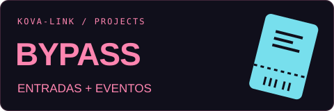
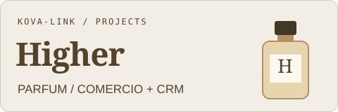
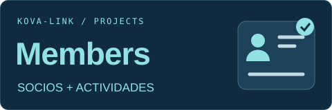
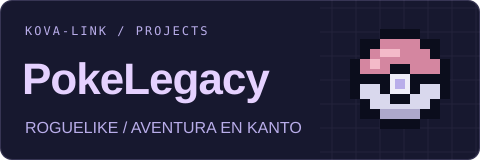

<div align="center">

<a href="https://kovalink.com.ar/">
  <picture>
    <source media="(prefers-color-scheme: dark)" srcset="assets/banner-dark.svg">
    <source media="(prefers-color-scheme: light)" srcset="assets/banner-light.svg">
    
  </picture>
</a>

<br>

**Sitios con identidad. Software que resuelve.**

[Portfolio](https://kovalink.com.ar/#portfolio) · [Contacto](mailto:info@kovalink.com.ar) · [Instagram](https://www.instagram.com/kova_link.website/)

</div>

## `$ whoami`

Soy **Fernando Kovalink**, desarrollador Full Stack y creador de **Kova-Link**. Desarrollo sitios web y aplicaciones a medida para negocios: desde una presentación comercial hasta un sistema para gestionar ventas, reservas, socios o eventos.

Me involucro en todo el proceso: entender qué necesita el negocio, diseñar la experiencia, desarrollar e integrar las funciones y acompañar el proyecto después de publicarlo.

```yaml
profile:
  name: Fernando Kovalink
  brand: Kova-Link
  role: Full Stack Developer
  location: Argentina
  education: Full Stack Developer · Coderhouse
  languages: Español · Inglés avanzado

focus:
  - Sitios web con identidad propia
  - CRM y sistemas de gestión
  - APIs, integraciones y bases de datos
  - Experiencias responsive y aplicaciones PWA
```

## `$ cat tech-stack.yaml`

Tecnologías que uso para llevar una idea a una aplicación funcional.

<table>
  <tr>
    <td width="50%" valign="top">
      <h3>01 / Frontend</h3>
      
      <p>React · TypeScript · JavaScript<br>HTML · CSS</p>
    </td>
    <td width="50%" valign="top">
      <h3>02 / Backend y datos</h3>
      
      <p>Node.js · APIs REST<br>SQL · PostgreSQL · SQLite / D1</p>
    </td>
  </tr>
  <tr>
    <td valign="top">
      <h3>03 / Cloud y despliegue</h3>
      
      <p>Cloudflare Workers · Pages · D1<br>Netlify · Dominios y DNS</p>
    </td>
    <td valign="top">
      <h3>04 / Herramientas</h3>
      
      <p>Git · GitHub · VS Code<br>Integraciones · PWA · SEO técnico</p>
    </td>
  </tr>
</table>

## `$ ls projects/`

Una selección de productos, demos y experimentos que desarrollo con Kova-Link.

<table>
  <tr>
    <td width="50%" valign="top">
      <a href="https://entradasbypass.com/"></a>
      <h3>ByPass</h3>
      <p><strong>Plataforma en producción</strong></p>
      <p>Eventos, entradas con QR y control de acceso. Panel Backstage con roles para organizar y gestionar cada evento.</p>
      <p><a href="https://entradasbypass.com/">Explorar plataforma ↗</a></p>
    </td>
    <td width="50%" valign="top">
      <a href="https://higherparfum.com.ar/"></a>
      <h3>Higher Parfum</h3>
      <p><strong>Proyecto para cliente</strong></p>
      <p>Catálogo público de perfumes y CRM privado para administrar pedidos, revendedores, stock y contabilidad.</p>
      <p><a href="https://higherparfum.com.ar/">Ver catálogo público ↗</a></p>
    </td>
  </tr>
  <tr>
    <td valign="top">
      <a href="https://link-members.netlify.app/"></a>
      <h3>Members Web</h3>
      <p><strong>Demo interactiva</strong></p>
      <p>Gestión de socios, cuotas, actividades y asistencia. Experiencias para administración, recepción, profesores y socios.</p>
      <p><a href="https://link-members.netlify.app/">Probar demo ↗</a></p>
    </td>
    <td valign="top">
      <a href="https://pokelegacy.net/"></a>
      <h3>PokeLegacy</h3>
      <p><strong>Proyecto personal</strong></p>
      <p>Juego web fan-made de Pokémon con recorrido roguelike por Kanto, combates automáticos, capturas y progresión del equipo.</p>
      <p><a href="https://pokelegacy.net/">Jugar PokeLegacy ↗</a></p>
    </td>
  </tr>
</table>

<p align="center"><a href="https://kovalink.com.ar/#portfolio"><strong>Ver más proyectos en el portfolio ↗</strong></a></p>

## `$ connect --kova-link`

**Tenés una idea o necesitás mejorar un sistema?** Escribime y vemos cómo darle forma.

<div align="center">

<a href="https://kovalink.com.ar/"></a>
<a href="mailto:info@kovalink.com.ar"></a>
<a href="https://www.instagram.com/kova_link.website/"></a>
<a href="https://github.com/FerKovalink"></a>

<br><br>

**[info@kovalink.com.ar](mailto:info@kovalink.com.ar)**

Código, diseño y atención al detalle. Desde Argentina · **Kova-Link**

</div>

<!-- Estructura de terminal inspirada en https://github.com/macu-dev/macu-dev. Textos y recursos SVG creados para Kova-Link. -->
